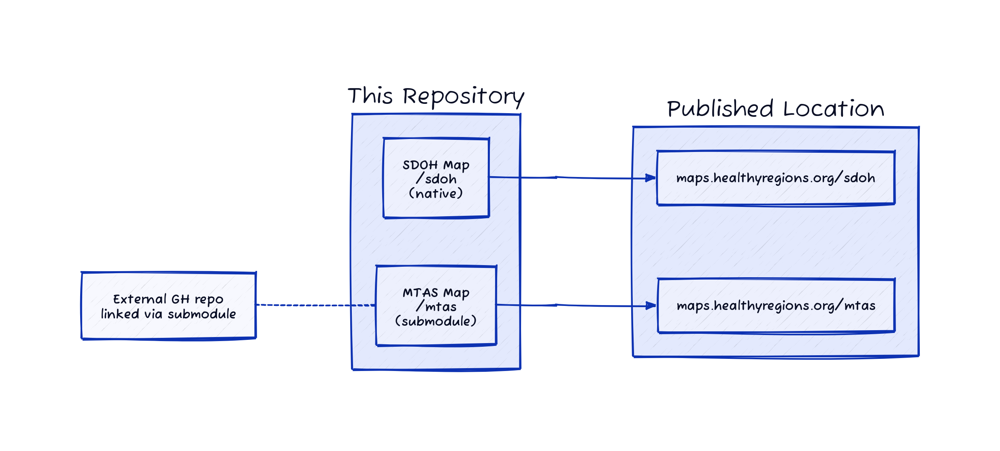
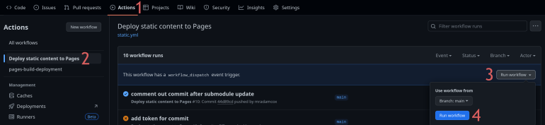

# Mapping projects -- Web map hosting for HEROP Lab

This is a central repository for using Github Pages to publish various projects from the Healthy Regions &amp; Policies Lab.

Individual projects are stored in subdirectories and published to `maps.healthyregions.org/<subdirectory>`. Such directories can contain content native to this repo, or can be submodules that link directly to other repositories.

For example, the `/sdoh` directory holds a single `index.html` file that redirects to a third-party location for a published map project (Carto). On the other hand, the `/mtas` directory is a submodule that points to [makosak/methadone-access-2023](https://github.com/makosak/methadone-access-2023), thereby effectively "re-publishing" that repostory to [maps.healthyregions.org/mtas](https://maps.healthyregions.org/mtas).



Submodules have the benefit of retaining an author's autonomy over the home repository, and also allows for the incorporation of existing projects.

Native subdirectories have the advantage of keeping all code in this repo, and being generally easier to deal with.

Both native subdirectory and submodule repos must have an `index.html` file in their root.

## Publish submodule updates

If changes are made to an external repo that is implemented here as a submodule, GitHub pages will need to be rebuilt for those changes to be published.

An admin of this repo can trigger the rebuild with the following four clicks:



The changes will be published within a few moments.

## Managing submodules

### Add/remove

In a local clone of the repo

```
git submodule add https://github.com/<user>/<repo> <subdirectory>
git commit
```

```
git rm <subdirectory>
git commit
```

### Maintenance

Note that the pages build process won't actually update submodules in the committed code base. For that, an admin can use something like:

```
git clone https://github.com/healthyregions/mapping-projects --recurse-submodules
cd mapping-projects
git submodule update --recursive --remote
git commit
```

## Analytics

To add basic analytics tracking to your project, put this line somewhere between the `<head>` and `</head>` tags of your `index.html` file:

```
<script defer data-domain="maps.healthyregions.org" src="https://plausible.io/js/script.js"></script>
```
